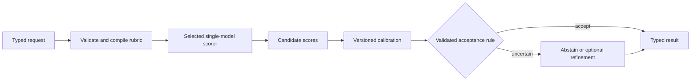

# OpenJeff — architecture and experimental program

Research snapshot: 2026-09-22 America/New_York / 2026-09-23 UTC. Budget ceiling: **$200 total incremental cash expense**. This records the initial architecture and execution plan. Subsequent training, runtime checks, measured results, and limitations are recorded in [the pilot results](../reports/RESULTS.md); the estimates below are not measured performance. OpenJeff is the chosen project name; the name is a personal homage to “My name is Jeff.”

## 1. Executive decision

**Build a calibrated, auditable decision engine first. Keep diffusion in the first bakeoff; defer the two-model hybrid until it earns its cost.** The first two serious competitors should be (A) Gemma 4 12B with direct answer-label logits and (B) DiffusionGemma with one structured denoising read, using djev as the reference implementation. A small Gemma 4 E2B control reveals the minimum useful footprint. Spend first on measurement and calibration, then one targeted LoRA run.

The handoff's diffusion-to-AR hypothesis is worth a controlled experiment, but the evidence does **not** justify making it OpenJeff's identity. A current diffusion-only implementation already performs well, and an AR Gemma fine-tune is also competitive. OpenJeff's useful contribution can be reproducible data, reliable probabilities, option-order robustness, clear abstention, and honest serving economics. A new neural bridge is optional.

**High-confidence conclusions**

- Direct candidate scoring avoids generation and parsing overhead. It does not establish correctness or calibration.
- Gemma 4 and DiffusionGemma have Apache-2.0 releases. Their downloadable weights do not disclose the entire foundation-training corpus. Open-source OpenJeff code and an open training recipe are feasible without claiming fully reproducible pretraining. [Google model card](https://ai.google.dev/gemma/docs/core/model_card_4), [DiffusionGemma card](https://huggingface.co/google/diffusiongemma-26B-A4B-it).
- One diffusion denoising read is a different experiment from iterative global refinement. Its performance cannot establish the “oil painting” mechanism.
- $200 can fund a useful pilot, subject to measured runtimes. It cannot credibly promise broad Jev parity, full multi-GPU fine-tuning, or a production SLA.

**Plausible hypotheses**: a Gemma 12B LoRA plus independent calibration can close part of the quality gap; calibrated diffusion scoring may be stronger than its raw probabilities suggest; an AR-only cascade may be as effective as a diffusion-to-AR cascade.

**Speculative research**: learned diffusion latent memory improves discrimination beyond equally expensive AR features; a small AR verifier preserves the useful information in that memory; iterative canvas refinement specifically improves evidence conflict detection. Each needs controls, not architectural intuition.

## 2. Verified landscape and provenance

### Jev and the benchmark target

TypeSafe currently documents `jev-1.13.0`; `jev-latest` and `jev-preview` both point there. It is a proprietary API reference, not a downloadable foundation for this project. Published input pricing is $0.042 per million tokens, with free output tokens. Pin the version returned by every evaluation call. Its advertised context limits are 64k total per request and 32k for state plus the longest question. These are provider facts, not measured OpenJeff capabilities. [TypeSafe models](https://docs.typesafe.ai/models).

JevBench is an independent Benchmark Heaven project, **not TypeSafe's official benchmark**. At repository commit `f79a1cab94ab9a5879383b7ef9ee1805b9dc2d84`, its current scorer is **v1.3.0** over the frozen **v1.2 task set**. The results filename still contains v1.2. The machine artifact was generated on September 21. There are 534 decisions: 72 easy, 96 standard, 146 judge, 220 hard. Its four equally weighted axes form a geometric mean; Intelligence is chance-corrected and tier-weighted, with an additional penalty below 50. Therefore “within two leaderboard points” does not mean “within two percentage points of accuracy.” [JevBench](https://github.com/fstandhartinger/jevbench), [scoring implementation](https://github.com/fstandhartinger/jevbench/blob/f79a1cab94ab9a5879383b7ef9ee1805b9dc2d84/jevbench/composite_v13.py).

Published results below are external measurements; OpenJeff has not reproduced them. ECE is a fraction, lower is better. The Calibration column is an aggregate benchmark axis, higher is better.

| System | Composite | Hard accuracy | Hard ECE | Calibration axis | Relevance |
|---|---:|---:|---:|---:|---|
| Jev 1.13.0 | 74.4 | 74.1% | 0.061 | 82.7 | External target |
| SemIf, Qwen3.5-4B | 73.1 | 59.5% | 0.121 | 72.6 | Disallowed inherited weights |
| djev, DiffusionGemma | 73.0 | 69.5% | 0.175 | 65.4 | Mandatory diffusion control |
| Winnow-12B Q8, Gemma 4 | 71.2 | 70.9% | 0.120 | 72.0 | Strong AR feasibility evidence |
| system-one-open, Gemma 4 E2B LoRA | 66.6 | 49.1% | 0.257 | 56.7 | Small-model control |
| OpenJev razorback16, DiffusionGemma NVFP4 | 66.4 | 65.5% | 0.178 | 64.8 | Runtime/quantization comparison |

Source: [pinned machine-readable results](https://github.com/fstandhartinger/jevbench/blob/f79a1cab94ab9a5879383b7ef9ee1805b9dc2d84/results/v1.2/jevbench-v1.2-results.json). The djev–Jev hard accuracy gap is **4.55 percentage points**, despite the 1.4-point composite gap. Calibration is a material opening for OpenJeff.

Winnow uses Gemma 4 12B LoRA, merged to Q8 GGUF; its training corpus is private, and its reported overlap audit cannot be independently repeated. Its public-benchmark-directed development is disclosed. Use it as an external control, not as a clean, auditable training starting point. [Benchmark provenance note](https://github.com/fstandhartinger/jevbench/blob/f79a1cab94ab9a5879383b7ef9ee1805b9dc2d84/docs/v1.2-additions-winnow.md), [author model card](https://huggingface.co/EldanRing/Winnow-12B).

SemIf's author confirms frozen Qwen weights with a specialized readout; reflex and jqv are also Qwen-based in the benchmark artifact. Their software techniques can inform the design, but their checkpoints are ineligible. system-one-open provides a relevant Gemma example; its existence does not make its dataset automatically acceptable. [SemIf](https://github.com/TheoLeeCJ/SemIf), [system-one-open](https://github.com/mithalouni/system-one-open).

### What “U.S. provenance” can establish

Use separate registry fields for developer, inherited parameter lineage, quantizer/adapter author, training-data sources, and synthetic teachers. Google's Gemma family is expressly accepted in the brief; this is a vendor/weight-lineage rule, not a claim that all DeepMind research, training compute, or training data originated geographically in the U.S. No reviewed model card establishes that stronger claim.

| Candidate | Parameters / lineage | License and openness | Decision |
|---|---|---|---|
| `google/gemma-4-E2B-it` | 2.3B effective; 5.1B including per-layer embeddings; Google Gemma | Apache-2.0 weights; incomplete pretraining transparency | Cheap control and eventual distilled student |
| `google/gemma-4-E4B-it` | 4.5B effective; 8B including embeddings | Same | Intermediate size only if E2B/12B bracket a useful gap |
| `google/gemma-4-12B-it` | 11.95B dense, Google Gemma | Same | Primary trainable AR baseline |
| `google/gemma-4-26B-A4B-it` | 25.2B total, 3.8B active MoE | Same | Matched-lineage AR control for diffusion |
| `google/gemma-4-31B-it` | 30.7B dense | Same | Short high-quality reference run; no initial tuning |
| `google/diffusiongemma-26B-A4B-it` | Gemma 4-derived block diffusion, about 26B / 4B active | Apache-2.0 weights | Mandatory one-read baseline |
| `allenai/Olmo-3-7B-Instruct` | Ai2 Olmo 3 base → SFT → DPO → RLVR | Apache-2.0; open data/code/checkpoints | Independent-lineage control; stronger auditability |
| `allenai/Olmo-3.1-32B-Instruct` | Ai2 Olmo 3 32B base → 3.1 post-training | Apache-2.0; model card notes incomplete intermediate RL checkpoints | Optional reference, not initial training |
| `nvidia/NVIDIA-Nemotron-3-Nano-30B-A3B-BF16` | NVIDIA states trained from scratch; 30B / 3.5B active hybrid Mamba–Transformer | NVIDIA Nemotron Open Model License, not Apache | Conditional alternate; not first pilot |

Sizes and Gemma lineage: [Google](https://ai.google.dev/gemma/docs/core/model_card_4). Ai2 stages: [Olmo 3 7B](https://huggingface.co/allenai/Olmo-3-7B-Instruct), [Olmo 3.1 32B](https://huggingface.co/allenai/Olmo-3.1-32B-Instruct). NVIDIA: [Nano card](https://huggingface.co/nvidia/NVIDIA-Nemotron-3-Nano-30B-A3B-BF16).

NVIDIA's Nano card explicitly discloses Qwen/DeepSeek synthetic teachers. That is **not inherited Qwen parameters**, but it may violate a broader provenance policy. Keep Nano conditional until that distinction is settled. Ai2's greater transparency makes inspection easier; it does not itself prove that every post-training teacher satisfies a stricter policy. Do not assume every model named “Nemotron” has the same ancestry: audit the exact checkpoint, especially Llama-derived and multimodal releases. The larger Nemotron family is outside this pilot's useful training scale. [NVIDIA technical report](https://arxiv.org/abs/2512.20848), [Olmo project](https://allenai.org/olmo).

“Open weights” means downloadable parameters. “Open source” applies clearly to code released with an appropriate license; it should not imply that undisclosed pretraining is reproducible. “Source-available” alone promises neither redistribution nor unrestricted use. Apache-2.0 is permissive; NVIDIA's named license allows commercial use and derivatives with its own terms. Research-only or noncommercial releases do not meet the deployment brief. Preserve upstream license/NOTICE files for code, adapters, weights, and datasets separately. [NVIDIA license](https://www.nvidia.com/en-us/agreements/enterprise-software/nvidia-nemotron-open-model-license/).

## 3. DiffusionGemma: what it actually supplies

The released model processes the prompt with a causal encoder and denoises a bidirectional output canvas that attends to cached context. Ordinary generation commits a finished block, encodes it into the cache, and continues. The model card specifies a 256-token canvas and context up to 256k; this is not bidirectional re-encoding of an entire arbitrary-length input on every iteration. Its published general reasoning results do not establish superior judgment quality. [DiffusionGemma card](https://huggingface.co/google/diffusiongemma-26B-A4B-it), [Google overview](https://deepmind.google/models/gemma/diffusiongemma/). An AR answer-position representation also attends to the preceding input; access to the whole problem is not unique to diffusion. The distinctive hypothesis concerns useful iterative revision, not mere context visibility.

The stock Hugging Face generation output lists `scores`, `logits`, and `hidden_states` as unused/None. Lower-level forward methods expose logits/hidden states; latent work therefore needs an instrumented forward/sampler, not `generate(...).hidden_states`. Record layer, encoder versus decoder, canvas position, denoising step, noise level, seed, and normalization for every extracted tensor. [Transformers API](https://huggingface.co/docs/transformers/en/model_doc/diffusion_gemma).

djev compiles typed questions into fixed template tokens and noisy answer slots, reads exact allowed-label logits after one denoising step, then normalizes them. Its compact canvas is an implementation-specific optimization, not proof that all default model canvas sizes behave identically. It adds no separately trained weights. Its documented reference runtime uses a B200 with BF16 weights/KV and pinned vLLM patches. The measured public API row is not automatically reproducible by simply running the newest repository checkout. [djev architecture](https://github.com/Davipar/djev-dev/blob/3ce907e6835212f27ee82b4cee9039198c4abe35/docs/architecture.md), [runtime](https://github.com/Davipar/djev-dev/blob/3ce907e6835212f27ee82b4cee9039198c4abe35/docs/runtime.md).

Current upstream vLLM also documents structured diffusion reads, including explicit label IDs, seeded canvases, step counts, and read-only execution. Start with the pinned djev reference for fidelity; separately test upstream support to reduce patch maintenance. Validate exact candidate-logit parity before changing runtimes. [vLLM example](https://docs.vllm.ai/en/latest/examples/features/structured_diffusion/).

Fine-tuning is available, not merely hypothetical. Unsloth publishes a DiffusionGemma A100 notebook. NeMo AutoModel documents full SFT and LoRA with an eight-GPU recipe; its diffusion training uses random-token corruption, self-conditioning and a frozen router. Neither establishes a cheap drop-in causal-LM training recipe. [Unsloth](https://unsloth.ai/docs/models/diffusiongemma), [NeMo recipe](https://docs.nvidia.com/nemo/automodel/latest/recipes-e2e-examples/diffusiongemma). NeMo's implementation uses a shared parameter stack for causal encoding and bidirectional decoding, with FSDP2/expert parallelism; inspect storage aliasing before estimating memory or inserting adapters. [NeMo model implementation](https://docs.nvidia.com/nemo/automodel/nemo-automodel/nemo_automodel/components/models/diffusion_gemma/model).

**Probability semantics:** a canvas logit describes a token under a particular corrupted-canvas conditional. It is not an AR sequence log-likelihood or automatically a calibrated event probability. Normalize the designated candidate slots, then fit and validate a separate calibration transform for each read mode. Never multiply several correlated slot probabilities and call the product a valid joint decision distribution.

## 4. Architecture to build first



Ship one selected scorer per deployment initially. The two research backends share the contract, not the probability calibrator. No mandatory external inference or teacher call belongs on the serving path.

**AR default.** Gemma 4 12B instruction-tuned, text-only requests, thinking disabled through its official template. Compile arbitrary candidate descriptions to verified single-token answer codes. Preserve the full rubric and state. Read the logit at the next answer position for every code in one forward pass. Validate code tokenization in the actual completion context; reject or use the sequence scorer if any code is multi-token. Do not infer missing candidates from a top-k list.

For score vector \(s\), use \(p_i=\operatorname{softmax}(s_i/T)\), \(T>0\). Report these as probabilities **conditional on the provided candidate set**. The confidence field is maximum calibrated candidate probability; expose normalized entropy separately. Renormalizing a bad candidate set can make the wrong answer look certain. Include an explicit insufficient-evidence candidate where meaningful, and a separate service status for abstention.

**Calibration.** Begin with one positive temperature per frozen backend/readout. Try per-type temperatures only with enough examples. Bind the calibration artifact to weights, tokenizer, prompt, candidate encoding, dtype/quantization, and runtime version. Fit on calibration-fit data only; audit on disjoint calibration-check and final sets. Calibration can improve probabilities but scalar temperature cannot change argmax accuracy.

**Gate.** Initially disable learned refinement and return an abstained result below a development-selected threshold. In the later gate experiment, estimate expected benefit from stage 1 entropy, margin, candidate count, input length, type, and inexpensive validation flags. Stage-2 disagreement is unavailable before stage 2 runs. Never train a routing gate on that unavailable feature. Missing/invalid evidence references force abstention or a clean reread.

**Refinement.** A permitted local AR backend receives the original evidence and, only in the handoff experiment, a bounded untrusted intermediate object. If the result remains unreliable or strongly disagrees, return `needs_review`; human review or an application-defined local verifier handles the next action. The model does not take an employment action by itself.

**Type semantics.** Choice returns a candidate ID and distribution. Noul returns \(P(yes)\), its complement, and the threshold used. Ordinal Score returns an argmax level and, if numeric levels are explicitly meaningful, an expected value and variance. Arbitrary ordinal labels are not automatically interval-scaled. Continuous values need either a declared discretization/range or a separately calibrated regression head. Ranking uses pairwise comparisons or a listwise head; check transitivity and report pairwise accuracy/NDCG as appropriate. These extensions are experiments, not implemented promises of the initial choice scaffold.

## 5. Alternatives A–F

All relative quality judgments below are hypotheses unless external evidence is identified. Costs compare identical input length, batching and precision.

| Architecture | Expected quality | Engineering | Inference cost / latency | Research risk | Deployment risk | Learning value |
|---|---|---|---|---|---|---|
| A: AR candidate logits | Competitive; Winnow supports feasibility | Low–medium | One prefill/read; likely economical | Low | Low–medium | Essential baseline |
| B: diffusion-only structured read | Competitive external evidence; raw calibration weaker | Medium | One prefill + canvas read; measure at concurrency | Medium | Medium from runtime specialization | Essential; may win outright |
| C: diffusion structured evidence → AR | Could fix conflict errors or amplify wrong guidance | Medium | Two stages plus intermediate generation | Medium–high | Medium | Cheapest test of semantic complementarity |
| D: diffusion latent → learned AR adapter | Unknown, no verified Jev evidence | Very high | Two resident models plus tensor transfer | Very high | High | Useful only after C/controls reveal headroom |
| E: diffusion → confidence gate → AR | Useful only if selective routing beats always-refine and AR-first | Medium–high | First-stage cost always; serial tails on escalations | High | Medium–high | Strong adaptive-compute test |
| F: diffusion → small AR verifier | Could match larger refinement with fewer AR parameters | High | Large first-stage footprint still dominates | High | High | Valuable precursor to distillation |

Add controls absent from the initial hypothesis: AR → same AR second pass; E2B → 12B gate; diffusion → more diffusion steps; independent AR and diffusion probability averaging with fitted weights; original-evidence-only refinement; and equal-GPU-time AR inference. A hybrid must beat the strongest cost-matched control, not merely its weakest first stage.

## 6. Training and data architecture

### Scoring and objective choices

1. **Single-token code logits:** primary dynamic-choice method. Randomize candidate order in training and measure permutation consistency at evaluation. Label tokens can have different priors; compare a fixed code alphabet and a learned bias correction on development data.
2. **Sequence likelihood:** \(s_i=\sum_t\log P(c_{it}\mid x,q,c_{i,<t})\). Include an end delimiter, score only completion tokens and cache shared prefixes. Raw sum favors short text; mean log-likelihood changes the objective and is a heuristic, not the probability of the whole candidate. Compare both rather than declaring length normalization correct.
3. **Constrained completion:** guarantees the syntactic answer space; score the full allowed space, not just the chosen completion. Measure repeated candidate-prefix work.
4. **Classification/projection head:** good for a fixed ontology. A static K-way head does not support arbitrary unseen candidate sets; for that use candidate-conditioned scores \(s_i=f(h_x,h_{c_i})\), trained with listwise CE and hard negatives.
5. **Pairwise ranking:** use \(P(i\succ j)=\sigma(s_i-s_j)\); pairwise logistic loss. Cost grows with compared pairs; tournament shortcuts can create order effects.

For target distribution \(y\), train \(L_{CE}=-\sum_i y_i\log p_i\). Hard labels are one-hot; genuinely stochastic or human-disputed cases may have justified soft labels. Do not relabel every difficult item as uniform. Evaluate a small Brier penalty \(\lambda\sum_i(p_i-y_i)^2\) on development data; avoid conflating loss tuning with final calibration. For ordinal targets compare ranked-probability loss \(\sum_{k<K}(\sum_{i\le k}p_i-\sum_{i\le k}y_i)^2\). Distillation uses \(\tau^2 KL(p_{teacher,\tau}\|p_{student,\tau})\) mixed with independently verified hard-label CE.

Train on answer-code discrimination. A standard all-token chat SFT loss mostly teaches format/state reconstruction and is not the primary decision objective. With LM SFT, mask prompt and intermediate rationale tokens; with candidate loss, gather the answer-position logits and apply CE over all allowed candidates. Calibration uses cached held-out logits, so no GPU is needed for fitting temperature.

### Adaptation ladder

| Stage | Change | Budget policy |
|---|---|---|
| Zero-shot | Stock IT weights, frozen prompts, direct logits | Always run; optional pretrained checkpoint is a separate control, not confused with IT |
| Harness only | Code mapping, templates, constrained/sequence readouts | Tune on development only |
| Calibration only | Fit T to cached scores | Always compare before training |
| LoRA | Rank 16, alpha 32, attention q/k/v/o initially, dropout 0.05; one epoch ceiling | Primary paid training candidate |
| Higher-rank LoRA | Rank 64; same dataset/token budget | Only if rank-16 underfits and evaluation improves |
| DoRA | Magnitude/direction adaptation, same token budget | Optional replacement for rank-64 run, not another unrestricted sweep |
| Full SFT | Smallest useful backbone, BF16 optimizer/sharding | Deferred unless PEFT plateaus with clean labels and a measured cost justification |
| Distillation | Best validated teacher → E2B or smaller audited model | After teacher capability established |

These hyperparameters are starting configurations, not tested optima. Use a short LR comparison (e.g. 5e-5 vs 1e-4) only if budget remains. QLoRA can reduce memory but changes numerical conditions; refit calibration after export. For diffusion, use its own denoising loss/recipe rather than passing it into a generic causal trainer. Current Unsloth documents Gemma 4 training across the selected sizes. [Gemma 4 training guide](https://unsloth.ai/docs/models/gemma-4/train).

Full SFT is presently unjustified: the question is whether a specialized readout and low-rank update close the gap, and 12B Adam-style training state alone can approach 192 GB at an illustrative 16 bytes/parameter before activations. That is a different experiment from a 12B BF16 inference footprint near 24 GB.

### Dataset contract and curriculum

```json
{
  "id": "policy-0182", "group_id": "policy-family-003",
  "split": "train", "task_type": "choice",
  "request": {
    "state": {"evidence": [{"id": "e1", "text": "..."}]},
    "question": "Which rule applies?",
    "candidates": [{"id": "a", "description": "..."}, {"id": "b", "description": "..."}]
  },
  "target": [0.0, 1.0], "evidence_ids": ["e1"],
  "provenance": {"source": "generator", "source_revision": "sha256:...",
    "license": "Apache-2.0", "teacher_ids": [], "label_method": "deterministic",
    "review_status": "verified", "parent_ids": []}
}
```

Start with 8k training items; reserve a later 4k hard-negative increment. The pilot should be diverse enough to falsify the approach, not a claim to cover every domain. Suggested initial mix: 35% deterministic rules/numeric/structured data; 25% grounded evidence and semantic judgments; 20% adversarial/conflict/abstention; 10% ordinal/pairwise; 10% long-context. Source-grounded examples require item-level permission and traceable source IDs.

Cover binary and multiclass judgment, semantic equivalence, entailment, entity resolution, evidence weighting, conflicting/noisy evidence, rubric evaluation, policy precedence, malformed input, adversarial instructions, temporal/numeric rules, and insufficient evidence. Add controlled stochastic tasks with exactly calculable distributions for uncertainty calibration. For continuous scores and rankings, build separate loss/evaluation tracks. Begin long-context tests at 2k/8k/16k, with later 32k; maximum advertised model context is not a memory guarantee.

**Generation pipeline:** define a symbolic scenario → independently compute labels → render diverse text → parse/check consistency → have a second allowed teacher blind-review linguistic ambiguity → keep verified labels and quarantine disagreements. Astra may author or review a modest subset, but it is neither the sole oracle nor a requirement at inference. Deterministic checks outrank teacher consensus on arithmetic. A second local Gemma/Olmo judge or another already available strong model can challenge labels; audit teacher output reuse terms before bulk generation. No new hosted teacher purchase is required for the first pilot.

Use 200 human-reviewed anchor items across domains and ambiguity types, with paired independent reviews on at least 50. Human agreement is itself a measurement. Retain ambiguous items with explicit abstention targets or adjudicated distributions; do not silently discard all disagreements and then claim good uncertainty handling. Hard negatives change one decisive fact, swap entity aliases, add a superseded rule, reverse an inequality, relocate decisive evidence, or inject a false intermediate summary. Keep each source family and all mutations in one split.

**Split before expansion:** train 8k (+up to 4k later), development 1k, calibration-fit 1k, calibration-check 1k, adversarial 500, production-simulation 500, final sealed 1k. These are targets; human review and generation time may require a smaller pilot with wider intervals. Hash group IDs before templating, deduplicate normalized content and approximate matches across splits, and separate source documents/organizations/templates/time ranges. Store training and evaluation manifests independently. Neither public JevBench rows nor paraphrases belong in training, calibration, or prompt selection.

## 7. Hybrid interface: retain evidence, limit influence

### Structured first implementation

The intermediate representation contains **checkable evidence links and bounded fields**, not a long private reasoning transcript:

```json
{
  "schema_version": "openjeff.ir.v1",
  "candidate_support": [
    {"candidate_id": "a", "support_ids": ["e7"], "conflict_ids": ["e9"]}
  ],
  "uncertainty_flags": ["conflicting_evidence"],
  "ambiguous_dimensions": ["effective_date"],
  "refinement_targets": ["e7", "e9"]
}
```

Keep an application-owned map from each evidence ID to the original immutable span. The model cannot mint evidence. Validate IDs, candidate membership, list lengths, schema version and a 512-token maximum before passing the IR onward. Preserve the original input and rubric even when the IR is accepted. A valid ID proves that a span exists, not that it supports the model's interpretation; the refiner must assess that itself. For the first experiment, omit the stage-1 final answer from the IR to reduce anchoring. Compare against an answer-included variant only as a declared ablation.

| Interface | Advantage | Main failure | Implementation choice |
|---|---|---|---|
| Free text | Simple | Unbounded claims, injection, output cost | Diagnostic control only |
| Strict structured object | Inspectable, versionable, explicit spans | Wrong support assignment can still bias stage 2 | **First hybrid** |
| Soft-prompt prefix | Small learned interface with fixed token budget | May suppress evidence or carry prompt injection semantically | First advanced bridge |
| Latent adapter/residual | Layer-specific conditioning | Scale mismatch, router/position mismatch, difficult attribution | Later ablation |
| Cross-attention memory | Separates memory from token stream; controllable access | New attention path/kernels and training costs | Strong advanced research candidate |
| Shared embeddings | Looks simple for related families | Same tokenizer/dimension does not align representations | Do not directly substitute tensors |

**Advanced recommendation:** freeze both foundations, pool selected diffusion decoder states into 16–32 memory vectors, LayerNorm, project through a small MLP/resampler to the AR input width, and insert them as a labeled soft prefix while preserving the complete original text. Train the bridge plus a small AR LoRA if necessary. Specify the noise schedule and take states only from inference-available tensors. Never extract encoder states from a training sequence containing the gold answer for inference features.

For a residual variant, \(h'_{AR,\ell}=h_{AR,\ell}+\alpha_\ell A_\ell(h_{diff})\), initialize \(\alpha\) near zero and learn it with regularization. Spatial/sequence alignment must be defined; do not add unequal token grids elementwise. With a prefix, causal position IDs and attention masks must allow answer tokens to attend to memory without exposing future gold tokens. With a cross-attention bridge, memory width is fixed but candidate/state lengths remain variable. Record tensor shape and dtype at every boundary.

Controls: zero memory, shuffled memory from another example, same-size random vectors, pooled AR-only states, diffusion encoder-only states, and a trained projection with identical parameter count. If an equal-budget AR representation does as well, there is no demonstrated diffusion-specific benefit. Same-family tensors may share dimensions while representing different distributions; compatibility is an engineering convenience, not semantic equivalence.

For E2B/E4B, soft-prefix engineering also has to account for per-layer embedding inputs. Arbitrary `inputs_embeds` do not automatically provide meaningful per-layer token lookups; the Transformers interface exposes `per_layer_inputs` for this reason. Prototype the bridge against 12B first, and use the textual IR for the small verifier until this path is implemented and tested. [Gemma 4 forward interface](https://huggingface.co/docs/transformers/en/model_doc/gemma4).

## 8. Evaluation protocol and benchmark limitations

JevBench's hard tier includes 111 public and 109 held-out items, with ten families spanning policy, ambiguity, adversarial input, arithmetic, multihop evidence and probability. Its authors used cross-model review; the probability subset has only 20 items. A Gemma 4 31B pilot informed difficulty, so the suite is not a neutral exhaustive sample of enterprise work. [Hard-tier construction](https://github.com/fstandhartinger/jevbench/blob/f79a1cab94ab9a5879383b7ef9ee1805b9dc2d84/datasets/HARD-TIER.md).

JevBench's MIT license covers its harness and specified original public data; imported task text has separate terms. Do not redistribute the whole underlying evaluation corpus under OpenJeff's license. Its 72 original, 48 easy and 111 hard public rows form the 231 redistributable public items described by the project. The full 534-item official evaluation requires the maintainer's private/imported material; a local public-only run must be labeled **partial**, never an official leaderboard reproduction. [Third-party notice](https://github.com/fstandhartinger/jevbench/blob/f79a1cab94ab9a5879383b7ef9ee1805b9dc2d84/THIRD-PARTY.md), [repository limitations](https://github.com/fstandhartinger/jevbench).

Further limitations: serial internet latency is not concurrency capacity; some endpoint times receive assumed adjustments; hosted tariff estimates are not measured GPU ownership costs; provider aliases can drift; public development may contaminate comparisons without exact text overlap. The existing combination study is an older v1.2.6 analysis and should not be treated as a current v1.3 score comparison. It provides a caution that extra inference can erase accuracy gains, not proof that OpenJeff's hybrid cannot work. [Published results](https://github.com/fstandhartinger/jevbench/blob/f79a1cab94ab9a5879383b7ef9ee1805b9dc2d84/RESULTS-v1.2.md), [combination study](https://github.com/fstandhartinger/jevbench/blob/f79a1cab94ab9a5879383b7ef9ee1805b9dc2d84/RESULTS-COMBINATIONS.md).

Use the internal development set for architecture/prompt selection; calibration-fit for T; calibration-check for auditing T; adversarial and production simulations for documented diagnostics; final sealed data for one confirmatory comparison after freezing. If a final failure triggers redesign, that set becomes development and a fresh final set is required. Select gate thresholds from out-of-fold predictions within development, not the final set. External Jev calls use public or synthetic non-sensitive data only and are optional for the initial offline pilot.

### Required measurements

| Area | Measurements and interpretation |
|---|---|
| Quality | Overall micro and macro accuracy, Choice/Score/Noul accuracy, task-family slices, ordinal MAE/distance, pairwise ranking accuracy; score expected-value error separately |
| Calibration | NLL, multiclass Brier (sum over classes, no divide by K), 15-bin ECE with counts, equal-frequency ECE sensitivity, reliability curve, NLL against justified soft targets; probability-fidelity separate from hard-label accuracy |
| Confidence failures | Fraction of all items wrong with pmax ≥0.9, error rate among pmax ≥0.9, correct items with pmax <0.6, bin-level signed confidence-minus-accuracy |
| Selective prediction | Risk–coverage curve, AURC, accepted accuracy and coverage, risk upper confidence bound; include all failed/abstained requests in coverage denominator |
| Hybrid | Wrong→right and right→wrong counts, unconditional gain/damage, conditional repair/break rates, stage disagreement, error phi correlation, oracle-union ceiling, gate AUROC/AUPRC, escalation fraction, gate precision/recall for beneficial refinement, accuracy on escalated cases |
| Robustness | Candidate permutations/polarity flips, rubric paraphrases, evidence location shifts, conflicting IR, missing evidence, prompt injection, out-of-domain abstention, quantization and runtime parity |
| Performance | End-to-end p50/p95/p99, device service time, throughput, GPU-seconds/judgment, prefill tokens/sec, generation tokens/sec only when relevant, peak allocated/reserved VRAM, KV/workspace use, timeout/error rate, batch efficiency |
| Economics | All-in $/1k and $/1M successful judgments, separately attempted requests and failures, at concurrency 1/4/16/32 and measured arrival rates; include idle time, startup, storage, calibration and retry cost |

Define \(G=P(wrong_1\land right_2)\), \(D=P(right_1\land wrong_2)\). Then \(Acc_2-Acc_1=G-D\) on the same examples. Also report \(g=P(right_2\mid wrong_1)\), \(d=P(wrong_2\mid right_1)\), so the net change is \((1-Acc_1)g-Acc_1d\). Comparing the two conditional rates directly is misleading because the populations differ. For routing, compute these on the routed subset and population-weight the result. If either error vector has zero variance, phi correlation is undefined, not zero.

Pair every comparison on identical examples and use a seeded **group-cluster bootstrap** with 95% intervals (2,000 resamples after the model-selection stage). Keep scenario mutations together. The scaffold includes a per-row bootstrap only for group-independent data and explicitly does not replace the grouped production evaluator. A 220-item hard set is too small to resolve small differences reliably: at 75% accuracy its simple binomial uncertainty is roughly ±5.7 percentage points. Use the internal larger set to select, then treat JevBench as external corroboration.

Performance protocol: warm-up 20–50 requests, run at least 1,000 timed requests per selected load point, repeat three windows if affordable, and report cold start separately. Use an open-loop arrival-rate test to expose queueing rather than only a closed-loop client that slows when the server does. p99 from tiny samples is not an SLA. Share-prefix question batching is a separate experiment: test whether adding unrelated questions changes a focal result. Tokens/sec from long generation does not predict typed-decision throughput dominated by prefill.

## 9. Numbered experiments and stop/go gates

Thresholds are **predeclared engineering targets**, not industry standards or performance forecasts. “Pass” refers to calibration-check/internal held-out diagnostics unless final confirmation is explicitly stated. Reserve final data until selecting at most two candidates.

| ID | Hypothesis and implementation | Training | Hardware / scope | Pass/fail criterion and unlocked decision |
|---|---|---|---|---|
| E0 | AR logits are already useful. Compare E2B and 12B; short 26B-A4B matched-lineage control if affordable | None; fixed code logits vs sequence scoring on dev | 1×L40S for small/12B; 1×H100 for MoE | Valid distributions 100%; no silent truncation; permutation disagreement ≤2%; establish accuracy/NLL/latency baseline. Otherwise fix readout before training |
| E0c | Calibration alone fixes excess confidence | Fit scalar T on 1k cached scores; optional per-type T | CPU | Check-set NLL improves ≥5% relative, Brier does not worsen >0.01; ECE ≤0.05 target. Keep uncalibrated control. Unlock gate development only if risk estimates hold |
| E1 | Small targeted adapter improves transferable judgment | Rank-16 LoRA on 8k → up to 12k examples, answer loss | 1×H100 80GB; QLoRA L40S fallback, 2k initial context | ≥2pp accuracy gain or ≥10% relative NLL improvement with accuracy loss ≤0.5pp; no family regression >3pp where adequately sampled. Recalibrate; unlock candidate release |
| E1b | E1 capacity-limited rather than data-limited | Rank-64 **or** DoRA; equal tokens, one selected run | Same GPU; replace optional run if necessary | ≥1pp extra accuracy or ≥5% NLL gain; otherwise retain rank 16 |
| E2 | Full SFT adds enough beyond PEFT | Full SFT on smallest demonstrated useful backbone | E2B: plan 2×A100 80GB; 12B: 4×H100 80GB with sharding, measured fit required | Deferred beyond pilot. Require ≥2pp over best PEFT and affordable inference; no authorization to exceed $200 |
| E3 | Diffusion one-read competes without training | Pinned djev, independent calibration; compare seed/canvas/1–4-step ablations only on supported path | 1×B200 reference, 4h cap; H100 custom path only after fit test | Within 2pp of best AR or ≥25% lower measured cost at comparable risk. Establish if diffusion deserves more investment |
| E4 | Structured diffusion evidence improves AR decisions | Frozen foundations; bounded IR generation and validation | Sequential models on 1×H100/H200 or B200 if fit; cache IR offline for quality study | ≥2pp gain over best cost-matched control, paired CI lower bound >0; unconditional damage ≤1pp; cost ≤1.5× for serving candidacy. Otherwise stop hybrid serving |
| E5 | Routing concentrates useful refinement | Out-of-fold small logistic/GBDT gate; compare diffusion-first with E2B→12B | CPU fitting; GPU replay plus real load test | AUROC ≥0.75 **and** accepted-risk bound passes; ≥25% GPU-seconds saved vs always-refine, accuracy loss ≤0.5pp, escalation ≤30%. Otherwise gate off |
| E6 | Learned latent interface adds information | Frozen foundations, resampler/projection ± AR LoRA; no gold leakage | 1×H200/2×H100 fit pilot; outside initial budget | ≥2pp over best structured/equal-compute control; shuffled/zero/AR-memory ablations show benefit; p95/cost cap passes. Only after E4 reveals complementary errors |
| E7 | Small verifier retains large-refiner quality | Diffusion→E2B/E4B, same loss and evidence controls | 1×H100/H200 or separate sequential runs | Within 1pp of 12B hybrid, ≥25% lower end-to-end GPU-seconds. If first-stage cost dominates, stop |
| E8 | Distillation removes the expensive teacher at serving | Verified labels + teacher probabilities into E2B | 1×L40S/H100; deferred until teacher passes | Within 2pp of teacher, ≤0.02 Brier regression, ≥2× throughput at same SLO. This may be the best release architecture |
| E9 | Different lineage reduces correlated errors | Olmo 3 7B same readout; Nano only if provenance accepted | 1×L40S/80GB GPU, short inference only | Keep only if lower risk or complementary error ceiling justifies another backend; no automatic training sweep |

E4–E8 are an **ordered research backlog**, not a promise to run every cell under $200. E4's sequential/offline quality evaluation cannot establish co-resident serving latency; label it accordingly.

**Global gates:**

- Freeze a single-model design if it is within 3pp of Jev on a genuinely paired independent evaluation, meets the acceptance-risk target, and is operationally affordable. A public-only comparison must stay public-only. Do not spend on a latent bridge merely to chase a small composite difference.
- Stop the hybrid if its gain is <2pp while GPU-seconds exceed 1.5× the strongest single-model/control, or if the interval includes no benefit after the planned sample size. Small inconclusive results mean “not enough evidence,” not “hybrid disproved.”
- Release target: ECE ≤0.05 overall and ≤0.08 on adequately sampled slices; Brier no worse than the strongest baseline; for accepted low-risk automation, empirical error ≤2% with a one-sided 95% upper bound ≤3% at ≥70% coverage. These targets are provisional utility requirements; consequential HR decisions need application-specific review and evaluation, not this generic threshold.
- If unconditional refinement damage >1pp, redesign or disable handoff. Poisoned-IR evaluation must retain ≥95% of the original-only baseline's correct decisions; otherwise omit the IR and reread original evidence.
- Require missing/unknown evidence references, malformed outputs, NaNs, budget exhaustion and backend failures to produce explicit errors/abstentions. A successful HTTP response is not necessarily an accepted decision.
- Provisional serving targets for the pilot are p95 ≤1 second for 2k-token requests at concurrency 4, and p95 ≤3 seconds for 8k-token requests at concurrency 4, with <0.1% runtime failure. These are goals to test, not observed capabilities; publish the whole load curve and choose a lower concurrency if necessary. No 16k/32k SLA is promised.
- Limit the first paid environment compatibility probe to **$10**. Stop a configuration on repeated OOM/runtime failure rather than burning the full allocation. Reassign budget only after recording the failure.

## 10. Hardware, serving economics and the $200 envelope

### Memory estimates, not fit guarantees

Raw BF16 parameter storage is approximately \(2P\) bytes: E2B including embeddings ~10.2 GB, E4B ~16 GB, 12B ~24 GB, 26B MoE ~50–52 GB, 31B ~62 GB. Total/resident parameters determine weight memory; active parameters do not. Shared diffusion encoder/decoder storage must not be counted twice. Quantized files add scale/metadata overhead, and load-time peaks may exceed steady-state memory.

| Work | Starting configuration | Important limitation |
|---|---|---|
| E2B/E4B inference, short contexts | 24GB GPU; L40S 48GB comfortable for batching | Effective size is not resident size |
| 12B BF16 inference | L40S 48GB | Start at 2k/8k context, measure peak allocations |
| 12B LoRA | H100 80GB, microbatch 1, gradient checkpointing; accumulation | 48GB QLoRA is plausible, recipe- and length-dependent |
| 26B diffusion / AR MoE BF16 | H100/A100 80GB for fit pilot; djev's pinned reference is B200 | Memory fit does not imply reference kernel support |
| 31B BF16 inference | H100 80GB at small batch/context; H200 for margin | Reserve KV/workspace; no default 256k |
| Diffusion + 12B BF16 co-resident | H200 141GB or B200 180GB starting point | ~76GB weights before KV/workspace; H100 80GB is too tight for a blanket promise |
| Full 12B Adam SFT | 4×H100 80GB, sharded optimizer, short context | Budget-excluded; activations and communication matter |
| Diffusion full SFT / NeMo published recipe | 8-GPU recipe | Budget-excluded |

A100 supports BF16/FP16 but has no native FP8 tensor-core acceleration. H100/H200 and L40S have FP8 capability; a compatible kernel and quantization method are still required. B200 adds native FP4-class acceleration; NVFP4 is not a generic 4-bit format that can be assumed fast everywhere. No pilot result transfers across precision without an accuracy/calibration check. [NVIDIA A100 architecture](https://www.nvidia.com/en-us/data-center/a100-gpu/), [L40S specifications](https://www.nvidia.com/en-us/data-center/l40s/), [Runpod GPU comparison and specifications](https://www.runpod.io/articles/comparison/choosing-gpus).

For an ordinary GQA layer, KV storage is approximately \(2BLH_{kv}d_hb\) bytes, summed over layers. Adapt this to the actual Gemma configuration: sliding windows bound some layers, shared/unified K/V may reduce storage, and runtime cache allocation can exceed live tensors. Measure actual allocation as input length and concurrency vary. Queue limits, chunked prefill, batch token limits and candidate counts are explicit deployment parameters.

### Paid pilot allocation

The following uses Runpod's published Pod guide rates observed in this research; these are **estimates**, not reserved availability, account quotes, or Serverless rates. Select an available U.S. region and reprice at launch. [Provider rates](https://www.runpod.io/articles/comparison/choosing-gpus), [pricing page](https://www.runpod.io/pricing).

| Allocation | Ceiling | Rate basis | Planned cost |
|---|---:|---:|---:|
| Small/12B baseline and final verification | 16 L40S GPU-hours | $1.09/h | $17.44 |
| Primary adapter run(s), including setup | 14 H100 SXM GPU-hours | $3.49/h | $48.86 |
| Diffusion reference compatibility and benchmark | 4 B200 GPU-hours | $6.79/h | $27.16 |
| Repeat/winning run or fallback | 8 H100 SXM GPU-hours | $3.49/h | $27.92 |
| Storage/download-related overhead allowance | — | Fixed allowance | $10.00 |
| Optional teacher/reference API allowance | — | Fixed allowance; zero by default | $10.00 |
| Restart/rounding allowance | — | Fixed allowance | $8.62 |
| **Planned spending stop** | | | **$150.00** |
| **Unallocated reserve, including taxes/price drift** | | | **$50.00** |
| **Absolute all-in ceiling** | | | **$200.00** |

The initial draft preceded GPU rental. Current spending and cleanup status are recorded in [the ledger](../reports/spending.json). Do not prepay $200 just to begin. Confirm provider quote and billing increment, debit setup/idle/download time as billable, and maintain one active billable GPU job at a time. Use a provider-side expiry/termination mechanism independent of the training process, plus an external watchdog; stopping Python does not stop GPU rent or persistent-volume charges. Terminate the instance and unneeded storage, verify provider state, reconcile invoices, then release the reserved liability. Budget arithmetic in this repository is **a preflight estimate, not a billing kill switch**.

Run a 100-step pilot, measure tokens/sec and peak memory, then estimate \(hours=training\_tokens/(3600\times measured\_tokens/sec)\), multiplied by measured checkpoint/evaluation overhead. Cancel or shorten the dataset/epochs if the allocated wall-clock cap cannot finish. The $200 limit funds whichever experiments fit, not an obligation to overspend to finish the matrix.

### Honest operating cost

At GPU rental \(r\) dollars/hour and measured sustained throughput \(q\) judgments/sec, compute-only cost is \(C_{1k}=1000r/(3600q)\), \(C_{1M}=1000C_{1k}\). At partial utilization, include idle paid time directly rather than assuming the peak throughput runs all day. Add CPU/storage/network, failed requests, and amortized setup/training separately.

Example **scenario, not a benchmark**: an L40S at $1.09/h costs $0.303/1k at 1 judgment/sec or $0.0303/1k at 10/sec, before overhead. At 10% utilization of that 10/sec capacity, effective compute cost returns to $0.303/1k. To match the published JevBench Jev tariff of ~$0.0399/1k, compute alone needs ~7.59 sustained judgments/sec on that rental. The user may rationally prefer self-hosting for control even when it costs more. Low concurrency and strong locality are separate from high utilization.

## 11. Production service and repository

Use a typed HTTP API with a schema compiler, bounded scheduler, scorer workers, calibration registry and decision policy. Cache immutable schema/prefix compilation; never cross tenant boundaries in cache keys. Authenticate before model access, enforce tenant scope outside prompts, impose byte/token/candidate limits, and preserve schema/model/calibrator IDs in every response. The initial deployment should be text-only; multimodal input expands both provenance and validation scope.

Example result:

```json
{
  "status": "decided",
  "decision": "needs_more_evidence",
  "probabilities": {"approve": 0.08, "deny": 0.10, "needs_more_evidence": 0.82},
  "confidence": 0.82,
  "normalized_entropy": 0.54,
  "calibration_id": "sha256:...",
  "refined": false,
  "model_path": ["gemma4-12b:revision+adapter+readout"],
  "diagnostics": {"evidence_ids": ["e7"], "request_id": "..."}
}
```

Numbers here illustrate the contract; the displayed entropy is rounded. Do not expose hidden chain-of-thought. Evidence references are optional separately checked diagnostics, not proof of a faithful causal explanation. Log operational metadata and hashes by default; encrypt and access-control any retained inputs. Training/feedback capture is a separate opt-in pipeline with retention controls.

| Stack | Role and current constraint |
|---|---|
| PyTorch / Transformers | Research reference; easiest logits/hidden-state access. Avoid full sequence×vocabulary logits when only the final position is needed |
| vLLM | Preferred throughput candidate; Gemma support and structured diffusion examples exist, but exact candidate access and adapter compatibility need pinned tests |
| llama.cpp | Useful CPU/consumer GPU and GGUF path; Winnow provides a concrete AR example, Unsloth documents diffusion support. Revalidate quantized logits, not just text generation |
| TensorRT-LLM | Consider after workload stabilizes. Current table lists several Gemma 4 variants; that does not certify 12B Unified or structured diffusion parity |
| NeMo AutoModel | Documented diffusion SFT/LoRA, valuable later for distributed experiments |
| Unsloth | Practical small-budget Gemma adaptation and diffusion experiment recipes; pin code and notebook dependencies |

References: [vLLM support](https://docs.vllm.ai/en/latest/models/supported_models/), [TensorRT-LLM source support table](https://github.com/NVIDIA/TensorRT-LLM/blob/main/docs/source/models/supported-models.md), [Unsloth diffusion guide](https://unsloth.ai/docs/models/diffusiongemma).

For closed-environment serving, pre-stage approved artifacts, pin container digests and package versions, disable framework telemetry, set Hugging Face offline mode, deny outbound traffic at the network layer, and avoid unreviewed remote model code. Network denial provides the enforcement; a prompt cannot. Capture model/tokenizer/adapter/calibrator/data hashes, licenses, runtime build and GPU/driver details in the experiment record. Local JSONL plus checksummed files is sufficient initially; an experiment platform is optional and must not silently upload inputs.

Proposed growth layout (not every directory is implemented):

```text
openjeff/                 # implemented mathematical core and typed contracts
  adapters/              # reference HF scorer; diffusion protocol boundary
  calibration.py
  evaluation.py
  hybrid.py
training/                # later: candidate-loss trainers, PEFT recipes
data/                    # later: generators, lineage manifests, sealed splits
serving/                 # later: authenticated API and bounded scheduler
configs/                 # experiment and budget starting points
experiments/             # preregistered experiment records
provenance/              # exact model metadata revisions, license inventory
model_cards/             # model card; current trained pilot evidence linked above
research/snapshots/      # source text/metadata, commits, SHA-256 manifest
reports/                 # local smoke results and later real benchmark reports
docs/                    # this plan, decisions and GPU runbook
tests/                   # mathematical and boundary verification
scripts/                 # source snapshot / benchmark extraction tools
```

Release code under a permissive license, publish adapter recipes and redistributable datasets with lineage, preserve upstream notices, and report failed experiments. The plan recommends Apache-2.0 for original OpenJeff code. Existing research snapshots retain their upstream licenses. No film imagery/audio or upstream brand identity is needed for the name. Other unrelated “jeff/OpenJev” projects already exist; identify this project by owner/repository and describe it as independent.

## 12. Implementation scope and first 2–4 weeks

The companion Python scaffold implements score normalization, bounded temperature fitting, calibration/quality summaries, risk–coverage data, refinement transition metrics, evidence-ID IR validation, gate orchestration and budget preflight. A reference Hugging Face adapter reads all selected answer-code logits from an already staged pinned model. The later H100 compatibility and A100 training runs are described in [the pilot results](../reports/RESULTS.md). The diffusion adapter is deliberately a protocol boundary, not fabricated calls to `generate()` pretending to return useful likelihoods. A real backend should wrap the pinned structured-read runtime.

The scaffold operates on stored score vectors so the numerical pipeline can be tested without downloading weights. Toy examples are labeled synthetic fixtures and are not evidence of model quality. The hybrid orchestration uses an injected scorer, includes the original request, and demonstrates failure/abstention semantics. The research plan supplies training objectives and bridge pseudocode; it does not ship a completed training system or production HTTP server.

```python
# Real training loop shape; this is pseudocode, not a tested trainer.
batch = compile_examples(train_rows, candidate_permutations=True)
outputs = model(**batch.inputs, logits_to_keep=1)
candidate_logits = gather_per_example(outputs.logits[:, -1], batch.code_ids)
loss = masked_candidate_cross_entropy(candidate_logits, batch.targets,
                                      batch.valid_candidates)
loss.backward()
optimizer.step()

# No gold-dependent tensor is available to the inference bridge.
with no_grad():
    h = diffusion_forward(state, noisy_canvas, step=t).decoder_states[layer]
memory = bridge(pool(h, answer_and_evidence_positions))
ar_scores = ar_forward(original_request, soft_prefix=memory).candidate_logits
```

| Time | Work and deliverable | Cash discipline |
|---|---|---|
| Days 1–3 | Freeze contract, evidence schema, split rules, source/model pins; write anchor set; test calibration/math | CPU only; current scaffold starts this work |
| Days 4–7 | Run $10 compatibility probe, E0 and E3 on same internal cases; record seeds, memory, latency, order effects; E0c | One rented instance at a time; stop broken runtime quickly |
| Week 2 | Curate 8k verified examples; E1 100-step timing probe then bounded LoRA; refit T; choose single-model winner | Main 14h H100 allocation; no full SFT |
| Week 3, conditional | Error-pair/oracle analysis; E4 small quality study only if complementary mistakes; E5 offline gate and real latency confirmation | Use fallback allocation only if justified; rank-64/DoRA competes for same funds |
| Week 4, conditional | Final freeze and untouched evaluation; export adapter/card/data recipe/results; optional maintainer-run JevBench submission | Stop planned spend at $150; reserve protects $200 total |

Fastest falsification: if a good AR readout beats diffusion at equal cost, use AR; if calibrated one-read diffusion wins, use diffusion; if oracle-union accuracy offers little headroom, do not build a bridge. The project succeeds by finding and publishing the simplest adequate mechanism.

## 13. Risks, unknowns and cheapest disproofs

| Assumption at risk | Cheapest falsification |
|---|---|
| Diffusion contributes global evidence reasoning | Compare one read vs several steps vs matched Gemma AR, same input and GPU-time budget |
| Single-token logits represent requested decisions | Verify code token boundaries, polarity/order permutations, paraphrases and candidate mass |
| A high-confidence answer is safe to accept | Independent reliability/risk–coverage check; include deliberately missing evidence |
| More refinement always helps | Paired wrong→right/right→wrong table before any gate work |
| Same-family models have complementary errors | Error phi and oracle-union ceiling; compare Olmo independent lineage |
| IR helps rather than anchors | Wrong candidate support, swapped evidence and irrelevant IR controls, original-only comparator |
| LoRA is sufficient | Compare train/dev curves, rank-16 vs rank-64 or DoRA at equal tokens; audit labels first |
| Full tuning is necessary | Attempt calibration-only and targeted PEFT before buying multi-GPU time |
| Latent tensors are interchangeable | Frozen projection and zero/shuffle/AR-memory ablations; never direct tensor substitution |
| Tiny verifier makes hybrid cheap | Measure whole-path GPU-seconds including the large diffusion stage |
| Advertised context fits serving memory | 2k→8k→16k length/concurrency sweep with peak KV/workspace data |
| Vendor headquarters proves policy compliance | Review exact parameter ancestry and teacher/data lineage; mark unknowns |
| Public benchmark gains generalize | Source/template-separated internal final test; temporal and domain shift |
| $200 covers the intended run | 100-step token throughput estimate plus provider-side wall-clock termination |
| “Open source” makes results reproducible | Rebuild from released code, hashes and licensed data; disclose unreleased foundation pretraining |

### Completion status of this handoff

Completed here: current primary-source review, pinned public benchmark/runtime snapshots, model metadata pins, architecture/training/evaluation/budget plan, initial numerical scaffold and CPU tests. **Not completed:** GPU inference, training, actual Jev comparison, new checkpoint, production service, provider billing integration, private final dataset, or public repository publication. Those require the experimental execution described above; none of their outcomes is assumed.
