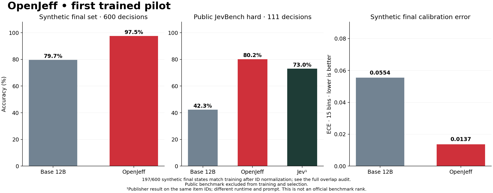

# OpenJeff 0.1.0 — measured pilot results

Follow-up: the [completed diffusion contribution study](HYBRID-RESULTS.md) reports
the separate H200 comparison. The historical A100 pilot measurements below and
the original release archive are preserved.

OpenJeff now has an original synthetic-data LoRA adapter, a frozen calibrator, and a checked local typed-decision endpoint. The development-selected backend is **adapter**, from step **500**. This is an experimental release. A synthetic-task score does not establish broad judgment quality or production readiness.

## What ran

- Foundation: Google Gemma 4 12B IT, revision `707f0a3b8a3c7ad586ed01e27eafbad8a27dd0f7`; BF16, no quantization.
- Training: 8,000 original rule-grounded examples, 20 families, one epoch, 500 optimizer steps. No teacher API, private data, or JevBench item was used for training.
- LoRA: rank 16, alpha 32, dropout 0.05; text attention projections only. Candidate-only cross entropy. Microbatch 4 × accumulation 4; peak learning rate 1e-4.
- Hardware: NVIDIA A100-SXM4-80GB; PyTorch 2.8.0+cu128, Transformers 5.17.0, PEFT 0.21.0.
- Full training/evaluation script wall time: 28.6 minutes, including staging. Peak allocated memory: 44.57 GiB.
- Checkpoints at steps 125, 250, and 500 competed only on development accuracy, then NLL. Selection was frozen before calibration and final model scoring.
- The saved adapter reloaded successfully, matched recorded probabilities through the loopback HTTP endpoint, and rejected an invalid request. See `runs/pilot-v1/service-verification.json`.

## Synthetic held-out results

| Split | Decisions | Base accuracy | OpenJeff accuracy | Base calibrated ECE | OpenJeff calibrated ECE |
|---|---:|---:|---:|---:|---:|
| calibration_check | 400 | 78.75% | 96.50% | 0.0862 | 0.0194 |
| final | 600 | 79.67% | 97.50% | 0.0554 | 0.0137 |
| adversarial | 200 | 75.50% | 97.00% | 0.0928 | 0.0206 |
| production_sim | 200 | 82.50% | 98.00% | 0.0613 | 0.0064 |

Final-set accuracy gain: **17.83 percentage points**, paired row-bootstrap 95% interval **[14.67, 20.83]**. The interval concerns this synthetic generator distribution, not unseen domains. Reversed options are excluded from the independent-row bootstrap.

Candidate-order disagreement on the final scenarios: base **22.00%**, adapter **1.83%**. These are paired original/reversed reads of the same scenarios.

Temperatures fitted on the separate 600-example calibration-fit set: base **2.7638**, adapter **1.0207**. All synthetic ECE values use 15 equal-width bins; NLL, Brier, reliability, and risk/coverage data are in `summary.json`.

Weakest adapter families in the final set:

| Family | Base accuracy | OpenJeff accuracy |
|---|---:|---:|
| sum_threshold | 33.33% | 70.00% |
| unit_conversion | 63.33% | 83.33% |
| ordinal_band | 80.00% | 96.67% |
| access_matrix | 93.33% | 100.00% |
| boolean_rule | 100.00% | 100.00% |

## Normalized-state overlap audit

A post-hoc check removes decorative case IDs and normalizes their copies in entity names. **197/600 final cases match a training state** under this rule. It ignores question wording and candidate order; it does not prove semantic novelty for the remaining cases. Finite boolean families account for many repeats. Exact request hashes include unique IDs and therefore are a weaker separation check.

| Final subset | Cases | Base accuracy | OpenJeff accuracy |
|---|---:|---:|---:|
| Matches a normalized training state | 197 | 87.31% | 100.00% |
| No match under that normalization | 403 | 75.93% | 96.28% |

This is a diagnostic slice, not a replacement benchmark or new model-selection criterion. Weights and temperatures remain frozen. Calibration-fit states also recur in later synthetic splits; see [the full audit](curriculum-overlap.json). Synthetic confidence metrics should not be read as independent-domain calibration evidence.

## Public JevBench transfer test

This diagnostic uses the pinned **231 public items** (48 easy, 72 original, 111 hard). It is not the full 534-item ranked benchmark and has no official composite score. The upstream scoring function is used, including exact labels and its implemented argmax rule for ordinal accuracy. Gold answers, rationales, author metadata, and gold probability distributions are excluded from prompts. The request guard is raised to 8,192 tokens for this diagnostic (longest observed prompt: 4,071); no evidence is truncated. The temperature is transferred from synthetic calibration without refitting.

| System | Easy (48) | Original (72) | Hard (111) | All public (231) |
|---|---:|---:|---:|---:|
| Base Gemma 4 12B — this run | 100.00% | 93.06% | 42.34% | 70.13% |
| OpenJeff — this run | 100.00% | 98.61% | 80.18% | 90.04% |
| Jev 1.13.0 (TypeSafe AI) — publisher result | 100.00% | 98.61% | 72.97% | 86.58% |
| djev (Maisa, diffusion-gemma) — publisher result | 100.00% | 98.61% | 67.57% | 83.98% |
| Winnow-12B Q8 — publisher result | 100.00% | 95.83% | 72.97% | 85.71% |

Reference rows are recomputed from the publisher’s recorded outcomes on the **same public IDs**. They use different runtimes and prompts and were not rerun here. [Pinned publisher evidence](https://github.com/fstandhartinger/jevbench/blob/f79a1cab94ab9a5879383b7ef9ee1805b9dc2d84/results/v1.2/jevbench-v1.2-per-task.json).

| Public hard probability quality | Base | OpenJeff |
|---|---:|---:|
| ECE, 10 bins | 0.2756 | 0.1417 |
| Mean absolute error versus exact gold distributions | 0.2837 | 0.2302 |

These public-task measurements are a transfer test, not evidence that synthetic calibration is valid for every enterprise workflow. No checkpoint or temperature was changed after this benchmark.

## Runtime and cost

| Public subset, serial local requests | Base | OpenJeff |
|---|---:|---:|
| Median request time | 63.3 ms | 72.3 ms |
| p95 request time | 497.8 ms | 553.3 ms |

These times include local prompt compilation and scoring. They exclude cold model loading, networking, admission queues, multi-user contention, and deployment overhead. No production concurrency or SLA is established.

**Cash paid: $10.00 of the $200 cap.** Credit consumption is accounted for separately in [the ledger](spending.json). Automatic top-ups are disabled; all three pods were terminated and the final account spend rate is $0/hour. Last observed credit: $6.89, provisional because billing can lag. A Python timeout does not terminate rental billing.

## What the results support

- A working, reproducible adaptation and probability-readout pipeline over an accepted Google weight lineage, with a real trained adapter and raw evidence.
- A narrow synthetic curriculum can improve these structured rule tasks substantially. The tasks have executable oracles and could be solved deterministically; they do not prove an LLM is needed for those rules.
- Unique case IDs prevent exact serialized request reuse but do not establish distinct reasoning problems. The normalized-state audit found 197/600 final cases matching training states; shared templates remain. This is not a natural-language domain holdout.
- The foundation pretraining corpus is not reproduced. U.S. vendor/weight lineage does not establish exclusively U.S.-sourced pretraining data.
- Container tag and package/model hashes are recorded. The OCI image digest was not captured; bitwise retraining reproducibility is not claimed.
- The B200 diffusion attempt failed during startup before model scoring. Its preflight source/dependency checks passed, but no diffusion inference score was obtained. See `reports/diffusion-attempt.json`. No latent bridge or learned refinement controller is claimed.
- Employment, medical, legal, or other consequential deployment quality has not been established by this pilot.

## Artifacts and reproduction

- `runs/pilot-v1/adapter/`: trained LoRA safetensors and loading configuration.
- `runs/pilot-v1/*-calibration.json`: both frozen calibrators, fit hashes, and scorer bindings.
- `runs/pilot-v1/`: raw scores, training log, frozen selection, base-file hashes, runtime, and summaries.
- `data/curriculum-v1/`: original Apache-2.0 adaptation data and manifest.
- [Usage and reproduction](../docs/using-openjeff.md); [architecture program](../docs/research-plan.md); [model card](../model_cards/openjeff-pilot.md).

